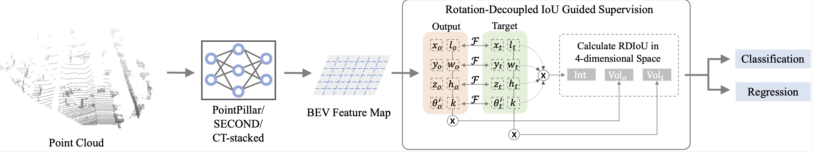

## "Rethinking IoU-based Optimization for Single-stage 3D Object Detection"

Thanks for the [OpenPCDet](https://github.com/open-mmlab/OpenPCDet), this implementation of the RDIoU is mainly based on the pcdet v0.5. Our paper can be downloaded here [ECCV2022](http://arxiv.org/abs/2207.09332). 

Abstract: Since Intersection-over-Union (IoU) based optimization maintains the consistency of the final IoU prediction metric and losses, it has been widely used in both regression and classification branches of single-stage 2D object detectors. Recently, several 3D object detection methods adopt IoU-based optimization and directly replace the 2D IoU with 3D IoU. However, such a direct computation in 3D is very costly due to the complex implementation and inefficient backward operations. Moreover, 3D IoU-based optimization is sub-optimal as it is sensitive to rotation and thus	can cause training instability and detection performance deterioration. In this paper, we propose a novel Rotation-Decoupled IoU (RDIoU) method that can mitigate the rotation-sensitivity issue, and produce more efficient optimization objectives compared with 3D IoU during the training stage. Specifically, our RDIoU simplifies the complex interactions of regression parameters by decoupling the rotation variable as an independent term, yet preserving the geometry of 3D IoU. By incorporating RDIoU into both the regression and classification branches, the network is encouraged to learn more precise bounding boxes and concurrently overcome the misalignment issue between classification and regression. Extensive experiments on the benchmark KITTI and Waymo Open Dataset validate that our RDIoU method can bring substantial improvement for the single-stage 3D object detection.

 The illustration of RDIoU method. We advocate a Rotation-Decoupled IoU to model the intersection of two rotated 3D bounding boxes. This design is further set as the optimization target to guide the classification and regression learning, respectively.

### The pretrained models
- Train on KITTI train set (only car) [Model-car](https://drive.google.com/file/d/1QQEMqOWtLrBj2izDGobA_NIUoVGmh2Eh/view?usp=sharing). 


### 1. Recommended Environment

- Linux (tested on Ubuntu 18.04)
- Python 3.6+
- PyTorch 1.1 or higher (tested on PyTorch 1.9)
- CUDA 9.0 or higher (tested on 11.1)

### 2. Set the Environment

```shell
pip install -r requirement.txt
python setup.py develop
```

### 3. Data Preparation

- Prepare [KITTI](http://www.cvlibs.net/datasets/kitti/eval_object.php?obj_benchmark=3d) dataset and [road planes](https://drive.google.com/file/d/1d5mq0RXRnvHPVeKx6Q612z0YRO1t2wAp/view?usp=sharing)

```shell
# Download KITTI and organize it into the following form:
├── data
│   ├── kitti
│   │   │── ImageSets
│   │   │── training
│   │   │   ├──calib & velodyne & label_2 & image_2 & (optional: planes)
│   │   │── testing
│   │   │   ├──calib & velodyne & image_2

# Generatedata infos:
python -m pcdet.datasets.kitti.kitti_dataset create_kitti_infos tools/cfgs/dataset_configs/kitti_dataset.yaml
```

- Prepare [Waymo](https://waymo.com/open/download/) dataset

```shell
# Download Waymo and organize it into the following form:
├── data
│   ├── waymo
│   │   │── ImageSets
│   │   │── raw_data
│   │   │   │── segment-xxxxxxxx.tfrecord
|   |   |   |── ...
|   |   |── waymo_processed_data
│   │   │   │── segment-xxxxxxxx/
|   |   |   |── ...
│   │   │── pcdet_gt_database_train_sampled_xx/
│   │   │── pcdet_waymo_dbinfos_train_sampled_xx.pkl

# Install tf 2.1.0
# Install the official waymo-open-dataset by running the following command:
pip3 install --upgrade pip
pip3 install waymo-open-dataset-tf-2-1-0 --user

# Extract point cloud data from tfrecord and generate data infos:
python -m pcdet.datasets.waymo.waymo_dataset --func create_waymo_infos --cfg_file tools/cfgs/dataset_configs/waymo_dataset.yaml
```

### 4. Train

- Train with a single GPU

```shell
python train.py --cfg_file ${CONFIG_FILE}

# e.g.,
python train.py --cfg_file tools/cfgs/kitti_models/rdiou.yaml
```

- Train with multiple GPUs or multiple machines

```shell
bash scripts/dist_train.sh ${NUM_GPUS} --cfg_file ${CONFIG_FILE}
# or 
bash scripts/slurm_train.sh ${PARTITION} ${JOB_NAME} ${NUM_GPUS} --cfg_file ${CONFIG_FILE}

# e.g.,
bash scripts/dist_train.sh 8 --cfg_file tools/cfgs/kitti_models/rdiou.yaml
```

### 5. Test

- Test with a pretrained model:

```shell
python test.py --cfg_file ${CONFIG_FILE} --ckpt ${CKPT}

# e.g., 
python test.py --cfg_file tools/cfgs/kitti_models/rdiou.yaml --ckpt {path}
```
